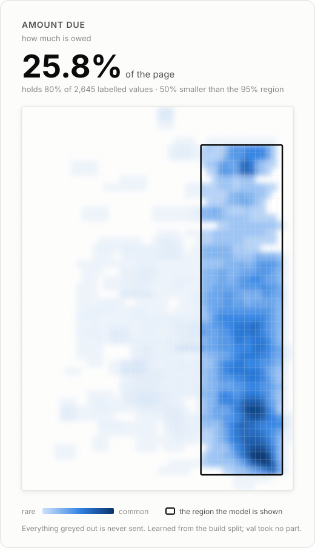

# <span style="color:#D6336C">Invoice extraction </span>

## <span style="color:#2E7D32">TL;DR</span>

<div align="center">
  <video src="https://github.com/user-attachments/assets/766e3c37-bc4c-42b8-a4dd-c989dd4a4230" controls width="720"></video>
</div>

_A short walkthrough of the workflow on the site — upload, live progress, review, export._

**<span style="color:#B8860B">1 · Learn from labeled invoices.</span>** We take as many human-labeled invoices as the client can provide, real scans with the answers, that's the data the whole process learns from.

**<span style="color:#B8860B">2 · Run OCR on the training data.</span>** We run OCR on each training document and obtain the location of the field value required (`amount_due` in our example case).

**<span style="color:#B8860B">3 · Read every page the same way.</span>** We normalize every word to page fractions (0–1), so a tiny scan and a full-page fax sit on one coordinate system.

**<span style="color:#B8860B">4 · Build a heat map.</span>** Over a 50×50 grid we count where a field's answer actually lands across thousands of documents, every cell its _whole box_ touches, giving a density map of where the answer lives.

<div align="center">
  
</div>

**<span style="color:#B8860B">5 · Draw the region.</span>** We take the smallest rectangle covering ~95% of that density. For `amount_due` it sits over the totals block, about ~23% of the page's _text_ (most of the rest it spans is margin).

**<span style="color:#B8860B">6 · Send only that — with a fallback.</span>** The model sees just that slice; the value is inside it **88%** of the time. But when the crop comes back empty — the model didn't find it there — we **fall back to the whole page**, and those documents pay for the crop _and_ the full page. That fallback is why the real saving is **14% fewer tokens** (86% of the baseline), not the crop's ~23%. Net across all 291: **+3.8 pts** accuracy at **14% cheaper**.

**<span style="color:#B8860B">7 · Score how much to trust it.</span>** Every value gets a confidence from _evidence_, not the model's say-so, whether it landed in its expected region (**99%** right when it did, **65%** when it didn't) and whether it passes deterministic checks (present in the OCR text, money-shaped).

**<span style="color:#B8860B">8 · Learn from the corrections.</span>** The unsure ones go to a human, one field at a time. When someone enters the right value we pin it to that file and record _where it sat_; once enough corrections form a pattern, the region shifts toward where this vendor really puts the field, so the same miss stops recurring.

Built for the Zamp project round (Problem 3: _turn messy documents into structured, queryable data_). The full reasoning behind every decision is in **[decisions.md](decisions.md)**.

> **Status:** **[▶ Live demo](https://invoice-extraction-108246044000.us-central1.run.app)** — deployed on Google Cloud Run. Bring your own OpenAI/Anthropic key to process an upload; the first visit is a slow cold start (~30–60s) while the OCR model loads, then it's fast. Runs locally too — see Setup. Extraction is scoped to one field, `amount_due`, done deeply rather than 55 fields done shallowly (see _Scope_ below).

---

## <span style="color:#2E7D32">What you get</span>

Turn scanned invoices into structured data — and, for every value, say **how much to trust it** and **where on the page it came from**. Upload one invoice or a hundred, watch each move through the pipeline, correct the few that need a human, and export the result.

---

## <span style="color:#2E7D32">The idea</span>

**<span style="color:#B8860B">1 · The model is a teacher, not a worker.</span>** We don't send the whole page. A _region_, the slice where this field usually lives, learned from thousands of invoices, is cropped and handed to the model; it falls back to the full page only when the crop comes up empty. Cost scales with new layouts, not invoice volume.

**<span style="color:#B8860B">2 · Confidence from evidence, not self-report.</span>** The signal we trust is _whether the value landed in its expected region_: measured at **99% correct when it did, 65% when it fell back**.

**<span style="color:#B8860B">3 · The model is never taken at its word.</span>** A returned value must appear verbatim in the OCR text, or it's flagged as invented rather than reported as fact.

**<span style="color:#B8860B">4 · Bring your own key.</span>** No API key ships with this repo. The web app makes a live model call **only** with the key you paste into the UI, sent per-request, never stored.

---

## <span style="color:#2E7D32">Results</span>

Measured on 291 held-out val invoices, live `gpt-4o-mini`:

|          | whole-page baseline | this pipeline | change       |
| -------- | ------------------- | ------------- | ------------ |
| accuracy | 73.5%               | **77.3%**     | **+3.8 pts** |
| tokens   | 74,181              | **63,918**    | **−14%**     |

Nearly **4 points more accurate** on **14% fewer tokens**. Full tables, and every rejected alternative, are in [decisions.md](decisions.md).

---

## <span style="color:#2E7D32">How learning works</span>

When a reviewer submits the correct value:

**<span style="color:#B8860B">The position is learned.</span>** We find the corrected value in the page's OCR and record _its box_. A corrected value fixes one document; a corrected **position** is evidence about every invoice shaped like it. Once enough corrections form a pattern (15), the region is **recomputed** to include where corrections actually landed (weighted 5×). One reviewer's slip can't drag it, it moves on signal, not noise.

Corrections persist across runs; clearing the session keeps them.

---

## <span style="color:#2E7D32">Setup</span>

Prerequisites: Python 3.9+, Node 18+, ~2.5 GB free (docTR pulls in PyTorch). No API key needed to _run_ it.

### <span style="color:#1565C0">Backend (FastAPI)</span>

```bash
python -m venv .venv && source .venv/bin/activate
pip install -r requirements.txt
uvicorn api.main:app --port 8000
```

### <span style="color:#1565C0">Frontend (React + Vite + TypeScript)</span>

```bash
cd web
npm install
npm run dev        # http://localhost:5173, proxies /api → :8000
```

For a single-origin build, `npm run build` emits `web/dist`, which FastAPI serves from `:8000` directly (no separate frontend process).

To use it: open the app, paste your OpenAI or Anthropic key on the Upload tab, choose PDFs, and watch the **Live progress** tab. The first document is slow (~15 s) while docTR loads its model once; it's warm after that.

### <span style="color:#1565C0">The key model, precisely</span>

**<span style="color:#B8860B">1 · Web uploads use only the pasted key</span>** (header `X-LLM-Key`). With no key, an upload is refused (`400`), unless `ALLOW_STUB=1`, which routes to an **offline stub** for development (no key, no cost, no real answers).

**<span style="color:#B8860B">2 · The `.env` key is for the CLI/eval scripts only.</span>** `OPENAI_API_KEY` / `ANTHROPIC_API_KEY` (see [.env.example](.env.example)) are never touched by the web server, so a deployed instance can't bill its owner for a stranger's upload.

**<span style="color:#B8860B">3 · Cheapest model by default</span>** — `gpt-4o-mini` / `claude-haiku-4-5`.

---

## <span style="color:#2E7D32">Data</span>

We build on [**DocILE**](https://docile.rossum.ai/) — a research dataset of **6,680 real business documents** (scans, photos, faxes), each with human-verified field values _and_ their bounding boxes. We kept the **tax invoices** and OCR'd every one with docTR, the same reader used at build time, at scoring time, and on your live uploads, so nothing shifts between them. It is verifiably hard: **34% have no text layer at all**, and the 916 layouts have a long tail of **519 seen exactly once**.

| DocILE tax invoices **3,850 labeled** |   docs | what it's for                                                                   |
| ------------------------------------- | -----: | ------------------------------------------------------------------------------- |
| **Train — build**                     |  3,142 | learn the heat map / regions, from human values + OCR                           |
| **Train — dev (seen layouts)**        |    250 | tune freely: a new invoice from a _known_ vendor                                |
| **Train — dev (unseen layouts)**      |    120 | tune freely: a vendor _never seen_ — the honest generalization check            |
| **Val — held out**                    |    338 | scored once, untouched until the end (291 carry `amount_due`)                   |
| **Test**                              | hidden | DocILE withholds test labels (a competition split), so val is our held-out test |

**<span style="color:#B8860B">1 · Where the labels come from.</span>** The train invoices carry the human-entered answers. We OCR each one to find where every answer sits on the page, and learn the regions from those positions, the same OCR everywhere, so building and scoring see identical text.

**<span style="color:#B8860B">2 · Why a dev cut.</span>** Dev is carved out of _train_, not val, so we can measure and re-tune as often as we like while **val stays sealed**. It's cut two ways: random documents (known vendor) and whole layouts held out (unseen vendor), because those are two different questions.

**<span style="color:#B8860B">3 · The published number is on untouched data.</span>** Every headline result is measured on **val**, looked at exactly once at the end, never used to tune anything.

Access is gated, see [data/README.md](data/README.md) to fetch it. None of it is needed to process your own uploads: live OCR plus the shipped region file (`data/region_amount_due_80.json`) handle those.

---

## <span style="color:#2E7D32">Repository layout</span>

```
api/          FastAPI service
  ocr.py        docTR: uploaded PDF bytes → words + boxes (warmed at startup)
  region.py     the learned page-region; crop, reading-order, re-learn helpers
  fingerprint.py layout signature + matching (known vs new vendor)
  pipeline.py   region-crop extraction for amount_due, with fallback
  fields.py     field config, prompt, amount checks, confidence
  progress.py   the live pipeline: one worker, stages, corrections, session reset
  store.py      SQLite: dedup cache + human corrections
  relearn.py    fold corrections back into the region
  render.py     page → PNG for the review viewer
  main.py       endpoints + serves the built frontend
web/          React + Vite + TypeScript frontend
  src/screens/    Upload, LiveProgress, Dashboard, …
  src/components/  ReviewPanel, PageView, …
scripts/      evaluation + data-prep (OCR cache, regions, baselines, pipeline runs)
data/         DocILE, OCR cache, learned regions, saved runs, store.db
decisions.md  the running log of real calls — what was chosen, rejected, and why
API.md        the API contract between api/ and web/
```

---

## <span style="color:#2E7D32">Evaluation & correctness</span>

**<span style="color:#B8860B">1 · A measurement harness</span>** in `scripts/` — baselines and pipeline runs that **persist one row per document** to `data/runs/*.jsonl` (inputs, the model's answer, verdicts, tokens), so a paid run is never thrown away or re-charged to re-analyse.

**<span style="color:#B8860B">2 · Honest splits</span>** — `train` (build), `dev` (a practice set retaken freely), `val` (scored once). Accuracy is reported **separately for repeat layouts and unseen ones**, the honest number most systems never publish.

**<span style="color:#B8860B">3 · Deterministic checks</span>** validate outputs (format, arithmetic, value-in-source) without ever consulting a model.

**<span style="color:#B8860B">4 · An automated suite + CI.</span>** `pytest` (44 tests) covers the region geometry, the layout-matching margin, the four extraction outcomes and the hallucination veto, the dedup/corrections store, and the HTTP contract — OCR and the model are stubbed, so it runs in under a second and never spends a cent. A **performance gate** re-scores the committed val run (accuracy ≥ 0.75, tokens ≤ 0.90× baseline). **GitHub Actions** runs all of it plus the frontend type-check, lint and build on every push.

---

## <span style="color:#2E7D32">Deliverables</span>

**<span style="color:#B8860B">1 · `decisions.md`</span>** — the reasoning log (required, and the most revealing file here).

**<span style="color:#B8860B">2 · GitHub repository</span>** — this.

**<span style="color:#B8860B">3 · Deployed URL</span>** — planned (HF Spaces on Docker); runs locally today.
